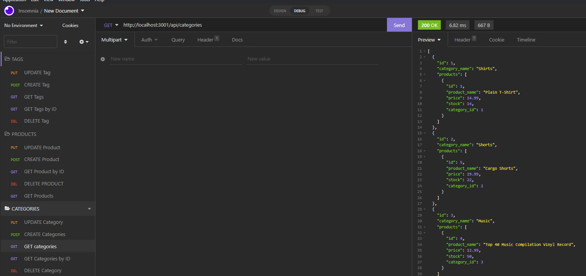
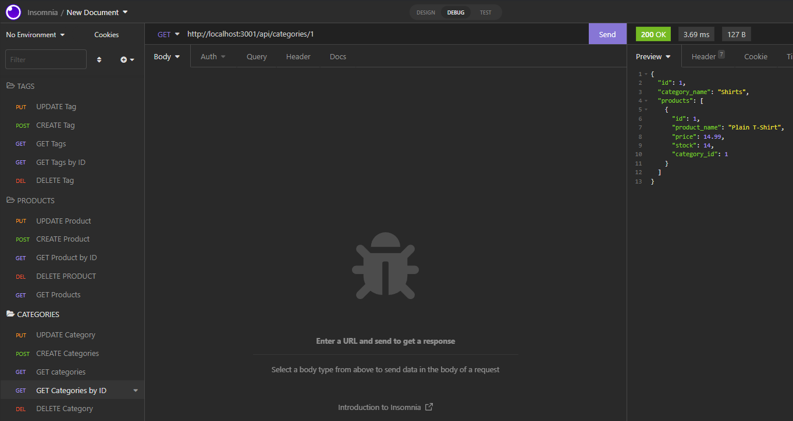
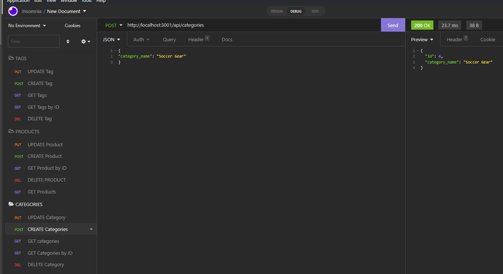
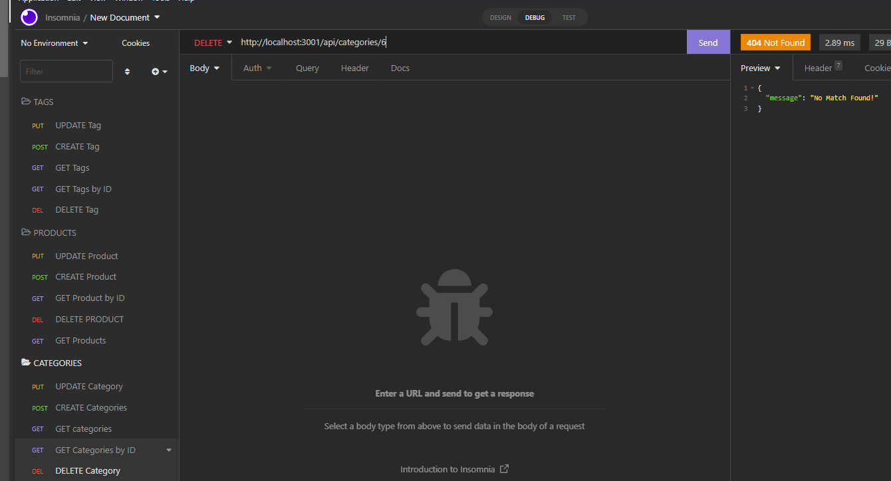

# E-Commerce_Back-End

## Badges
   

## Description 
This is a project built with just the back end of things. It is a e-commerce site that has sections such as categories, products, and tags. We can then have the option to see each section of this e-commerce site , view a specific section with calling a ID, add or update a specific section and finally delete the section. 

## Video Walkthrough
https://drive.google.com/file/d/16pk3N-ymLM7H-aRgA_GC14QjaKsxSjS8/view

Goes step by step on how to create and populate tables for our ecommerce page and call for each route for the specified section

## Visuals

<b> Shows us searching for all categories

<b> Us searching for only one specific category

<b> Us creating a new category

<b> and finally us deleting a category

## License
[MIT LICENSE](./license.md)